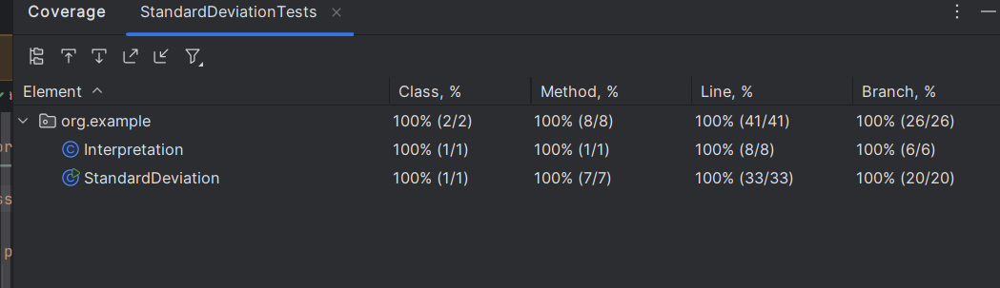

# Fall 2024 SWE 3643 Testing and QA Homework
## Nino Tkabladze

# Homework 2:
  1. Performed Branch Analysis  
     *Studied a block of pseudocode and converted it to a graph showing every possible path*
     ```mermaid
     flowchart TD
        
         StartA(((START Sample Std Dev))) --> FuncA
         StartB(((START Population Std Dev))) --> FuncB
              
         FuncA[ENTRY FUNC: Compute Sample Std Dev] --> FuncC
         FuncB[ENTRY FUNC: Compute Population Std Dev] --> FuncC
     
         FuncC[FUNC Compute Standard Deviation] --> isA
     
         isA{is valueList empty?} --> |Yes| errorA[[error]]
         isA --> |No|FuncD[FUNC Compute Mean of Values] --> isB
         
         isB{is valueList empty?} --> |Yes| errorB[[error]]
         isB --> |No| isC{is value in valueList?}
        
         isC --> |Yes| sumC[sum += value]
         sumC --> isC
         isC --> |No| Mean[Compute mean]
         Mean --> FuncE[FUNC Compute Square of Differences] 
         FuncE --> isD{is valueList empty?}
         
         isD --> |Yes| errorD[[error]]
         isD --> |No| isE{is value in valueList?}
     
         isE --> |Yes| squareAccumulatorE[squareAccumulator]
         squareAccumulatorE --> isE
         isE --> |No| SqrOfDiff[Square of Differences]
         SqrOfDiff --> FuncF[FUNC Compute Variance]
         FuncF --> isF{is not population?}
         
         isF --> |Yes| numValuesF[numValues--] --> isG{numValues<1}
         isF --> |No| isG
     
         isG --> |Yes| errorG[[error]]
         isG --> |No| Variance[compute Variance]
         Variance -->  stdDev[compute stdDev]
         stdDev --> ReturnStdDev((RETURN Std Dev))

     ```
  2. Converted Pseudocode to Operational Code  
     *Converted the pseudocode to operational, well-structured Java code*  
     [pseudocode](https://github.com/ninuljaja/SWE3643-Fall2024-Homework/blob/51c627d4de21e644ea02d66d5b8c154ad2bdbd28/Homework2/pseudocode.txt)
  3. Wrote Unit Tests  
     *Wrote 12 JUnit unit tests and achieved 100% coverage of every branch*
  4. Performed Coverage Analysis  
     *Achieved 100% coverage of all branches*
     